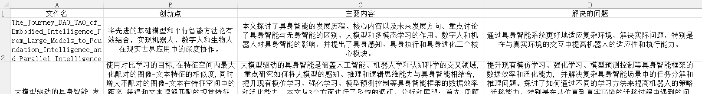

<div align="center">

# AI Paper Extractor

### 基于 LLM 的论文信息提取桌面工具

[](https://xiangjianxiaohuangyu.top/)

</div>

---

[English](./README.md) | [中文](./README.zh.md)

---

## Project Overview

AI Paper Extractor is a cross-platform desktop tool built with Electron + React + Python + LLM. It automatically extracts structured information from academic papers and exports standardized data results.

This project is positioned as:

1. A structured paper information tool for researchers
2. An extensible LLM desktop application template for developers
3. An engineering example with decoupled frontend/backend and independent packaging and deployment



## Core Features

### 1. Local Desktop Architecture

- Built with Electron
- Frontend: Vite + React + TypeScript
- Backend: Python FastAPI
- Supports PyInstaller packaging to standalone executable

**Advantages:**

- No browser dependency
- Can be deployed offline locally (except for model API)
- Suitable for enterprise intranet or research environments

### 2. AI-Powered Structured Paper Parsing

Automatically extracts from PDFs:

- Paper Title
- Author Information
- Abstract
- Research Methods
- Experimental Results
- Conclusions
- Custom Fields (extensible)

**Technical Features:**

- Based on pypdf text parsing
- Supports multiple model providers
- Supports custom Prompt extension
- Compatible with OpenAI API protocol


### 3. Multi-Model Compatible Architecture

Supports:

- Qwen
- OpenAI
- Any model service compatible with OpenAI API protocol
- Locally deployed models (e.g., vLLM / Ollama / Enterprise private models)

Model configuration is decoupled from business logic, supporting multiple configuration saves and switches.


### 4. Complete Engineering Build Process

Supports:

- Hot reload in development mode
- Independent backend packaging
- Full installer build
- Automatic environment detection
- Frontend/backend separated deployment

## Interface Overview

**Analysis Page**

- Drag and drop PDF upload
- Batch processing
- One-click structured extraction

**Configuration Page**

- Select model provider
- Fill in API Key
- Custom Base URL
- Multi-configuration management

**Environment Detection**

- Auto-detect Python environment
- Auto-detect backend service status
- Provide exception alerts

## Production Mode

### Download

Download the built installer from GitHub Releases:

👉 https://github.com/xiangjianxiaohuangyu/paper-extract-app/releases

After installation, you can use it directly without manually configuring Python environment.

### Production Architecture

```
Electron App
   ↓
backend.exe (PyInstaller packaged)
   ↓
FastAPI Service (localhost:8000)
```

**Features:**

- Backend compiled to executable
- No Python environment required
- One-click installation and running
- Suitable for non-developers

## Development Mode

### Environment Requirements

- Node.js 18+
- Python 3.10+
- Git

### Clone Project

```bash
git clone https://github.com/xiangjianxiaohuangyu/paper-extract-app.git
cd paper-extract-app
```

### Install Frontend Dependencies

```bash
npm install
```

### Install Backend Dependencies

```bash
cd server
pip install -r requirements.txt
cd ..
```

### Start Development Mode

```bash
npm run dev
```

This will simultaneously start:

- Vite Dev Server → http://localhost:5173
- FastAPI Backend → http://localhost:8000
- Electron Desktop App

### Run Components Individually

**Frontend only:**

```bash
npm run dev:vite
```

**Backend only:**

```bash
npm run server
```

or:

```bash
python server/run.py
```

**Electron only:**

```bash
npm run electron:dev
```

## Build & Release Process

### 1. Build Frontend

```bash
npm run build
```

### 2. Build Backend

```bash
npm run build:server
```

### 3. Build Complete Installer

```bash
npm run build:all
```

After build completes, the installer is located in: `release/`

## Tech Stack

**Frontend:**

- Electron 28
- React 18
- TypeScript
- Vite
- Ant Design 5
- Zustand

**Backend:**

- Python 3.10+
- FastAPI
- pypdf
- LangChain (optional extension)
- PyInstaller

## Project Structure

```
paper-extract-app/
├─ electron/
├─ src/                # React Frontend
├─ server/             # Python Backend
├─ release/            # Build Output
└─ package.json
```

## Use Cases

- Batch paper organization
- Scientific research information structuring
- Academic data preprocessing
- LLM engineering practice
- Desktop AI tool development template

## Author

- Name: lzp
- Website: https://xiangjianxiaohuangyu.top/
- Email: zhipenglin02@163.com
- Technical Focus: AI Engineering / Desktop Application Architecture / LLM Application Development

## Support

For issues or suggestions, please submit an Issue:

https://github.com/xiangjianxiaohuangyu/paper-extract-app/issues
